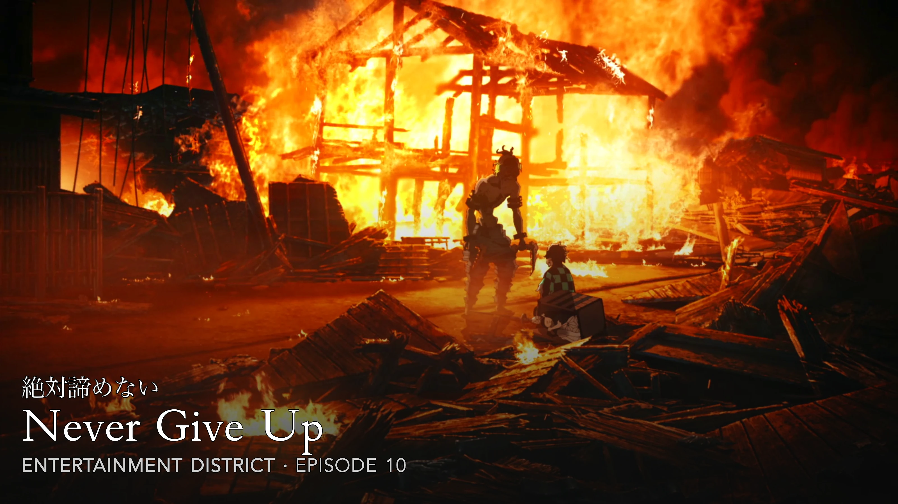
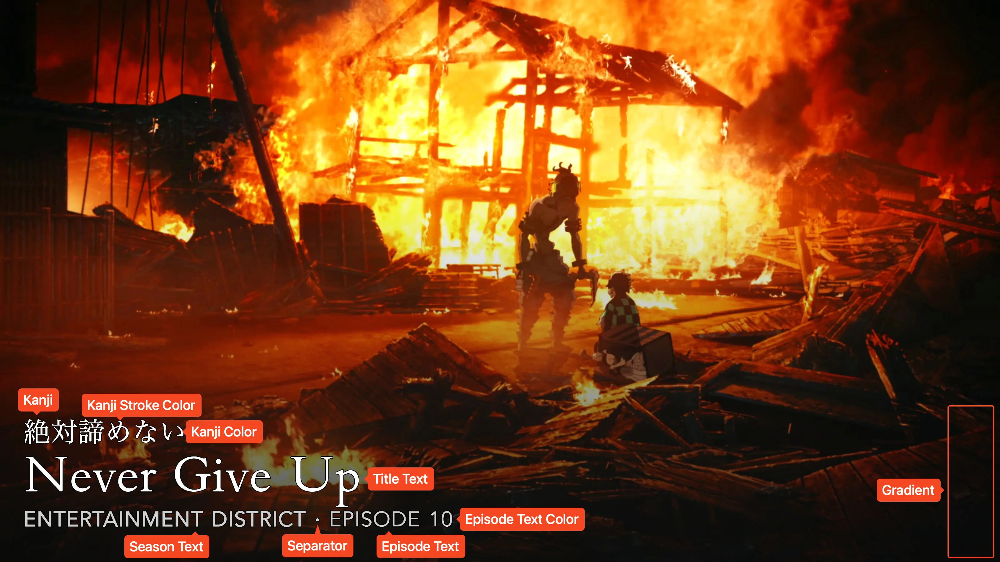

<link rel="stylesheet" type="text/css" href="https://unpkg.com/image-compare-viewer/dist/image-compare-viewer.min.css">

# Anime Card Type

This card design was created by [CollinHeist](https://github.com/CollinHeist),
and designed by Reddit user
[/u/Recker_Man](https://www.reddit.com/user/Recker_Man). Because this is the
only card which explicitly supports adding kanji, this is the de-facto
card type used for Anime series by _most_ users.

These cards feature relatively unobtrusive text in the lower left-hand corner of
the image. The kanji, title, and season/episode text can all be adjusted.

<figure markdown="span" style="max-width: 70%">
  
</figure>

??? note "Labeled Card Elements"

    

## Episode Text

Unless _explicitly_ stated otherwise, all "episode text" customizations refer to
both the season and episode text.

### Color

The color of the episode text can be adjusted with the _Episode Text Color_
extra. This will also change the color of the season text, but that can be
overwritten with the [_Season Text Color_](#season-text-color) extra.

??? example "Example"

    

        
        
    

### Size

The size of the episode text can be adjusted with the _Episode Text Font Size_
extra. Like all font sizes, values greater than `#!yaml 1.0` will increase the
size of the text, and values less than `#!yaml 1.0` will decrease it.

??? example "Example"

    

        
        
    

    A small vertical shift is also applied to the title text to avoid
    overlapping the episode text.

### Stroke Color

The color of the stroke used for the episode text can be adjusted with the
_Episode Text Stroke Color_ extra.

??? example "Example"

    

        
        
    

## Gradient Overlay

By default, TCM applies a subtle gradient overlay on top of the source image so
that the (default) white text appears more legible. If you would like to remove
this gradient overlay, set the _Gradient Omission_ extra to `True`.

??? example "Example"

    

        
        
    

## Logo

A logo file can optionally be added to various positions around the Card.

### Position

The position of the logo can be adjusted with the _Logo Position_ extra. By
default, this is set to `omit` - meaning no logo file will be added. Setting
this to any supported value other than `omit` will add the logo to the Card (if
the file is available).

??? example "Example"

    

        
        
    

### Size

The default size of the logo is quite small (in order to be unobstrusive). This
can be adjusted with the _Logo Size_ extra. Like all sizes, values greater than
`#!yaml 1.0` will increase the size of the logo, and values less than
`#!yaml 1.0` will decrease it.

??? example "Example"

    

        
        
    

## Kanji

### Adding Kanji

This card supports the addition of Kanji (Japanese text) to the Card through
TCM's built-in [translation](...) feature.

For the specified Series (or within a Template), add a translation which reads
as "Translate `Japanese` titles into `kanji`".

!!! tip "Recommendation"

    Rather than specifying this translation for each Series, it is recommended
    to use a [Template](../user_guide/templates.md) containing the correct card
    type and translation(s), and then add that Template to your Series.

    To go one step further, you can auto-assign this Template to a subset of
    your Series when [Syncing](../user_guide/syncs.md); _or_ add the Template
    with some filters (i.e. by library name) to your
    [Default Templates](../user_guide/settings.md#default-templates).

### Coloring

The color of the kanji text can be adjusted with the _Kanji Color_ extra.

??? example "Example"

    

        
        
    

### Requiring Kanji

If you want to __require__ kanji text to be present in order for a Title Card to
be created, you can set the _Require Kanji_ extra to `True`

This is _generally_ not recommended as TCM will automatically delete and remake
Cards if they were made without kanji (that was later added).

### Size

The size of the kanji text can be adjusted with the _Kanji Font Size_ extra.
Like all font sizes, values greater than `#!yaml 1.0` will increase the size of
the text, and values less than `#!yaml 1.0` will decrease it.

??? example "Example"

    

        
        
    

### Stroke Color

The color of the stroke which surrounds the kanji text can be adjusted with the
_Kanji Stroke Color_ extra. If unspecified, the stroke color will match that of
the [title text](#stroke-color_2).

??? example "Example"

    

        
        
    

### Stroke Width

The width of the stroke effect can be adjusted with the _Kanji Stroke Width_
extra.

??? example "Example"

    

        
        
    

### Vertical Shift

By default, TCM calculates the dimensions of the title text in order to position
the kanji text above it. However, if you want to manually offset the position
of the kanji, you can do so with the _Kanji Vertical Shift_ extra.

??? example "Example"

    

        
        
    

## Season Text Color

The color of the season text can be adjusted with the _Season Text Color_ extra.
If unspecified, this color matches the [_Episode Text Color_](#color), but this
extra overrides that.

??? example "Example"

    

        
        
    

## Separator Character

If both the season and episode text are displayed on the Card, then a separator
character is added between them. This character can be adjusted with the
_Separator Character_ extra.

The color of this character will be controlled by the
[_Episode Text Color_](#color) and [_Season Text Color_](#season-text-color)
extras, with the season coloring taking priority over the episode.

??? example "Example"

    

        
        
    

## Stroke Color

The color of the stroke applied to the title text can be adjusted with the
_Stroke Text Color_ extra.

??? example "Example"

    

        
        
    

## Mask Images

This card also natively supports [mask images](../user_guide/mask_images.md).
Like all mask images, TCM will automatically search for alongside the input
Source Image in the Series' source directory, and apply this atop all other Card
effects.

!!! example "Example"

    

        
        
    

