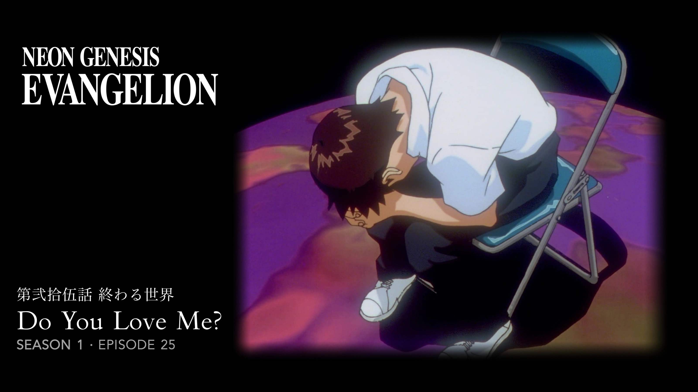
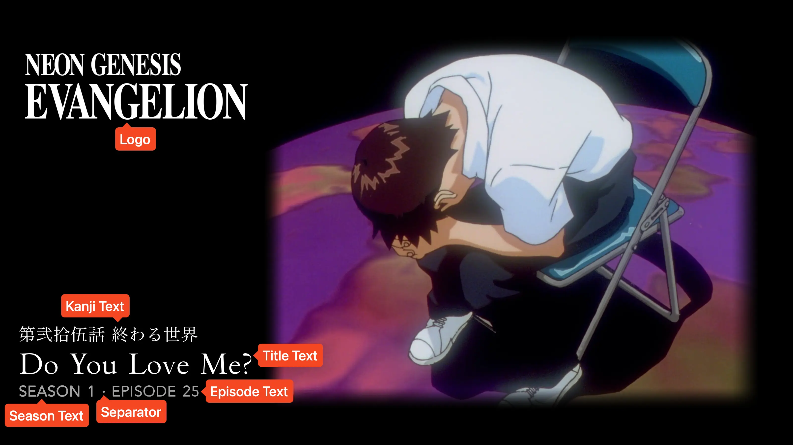

<link rel="stylesheet" type="text/css" href="https://unpkg.com/image-compare-viewer/dist/image-compare-viewer.min.css">

# Anime Fade Card Type

This card design was created by [CollinHeist](https://github.com/CollinHeist),
and the design was inspired by Yozora, Reddit User
[/u/Recker_Man](https://www.reddit.com/user/Recker_Man), Reicha7, and
drewstopherlee (as this is practically an amalgamation of the
[Anime](./anime.md) and [Fade](./fade.md) card types).

Cards of this style contain left-aligned text - including possible
Japanese/Kanji - on the left side of the image, alongside a logo; while the
right half contains the Source Image with a soft vignet fading into the black
background.

<figure markdown="span" style="max-width: 70%">
  
</figure>

??? note "Labeled Card Elements"

    

## Episode Text

Unless explicitly stated otherwise, all of the following extras will refer to
both the season _and_ episode text. "Episode text" is used for brevity.

### Coloring

The color of the episode text can be adjusted with the _Episode Text Color_
extra.

??? example "Example"

    

        
        
    

The color of the season text itself (not the season and episode text together)
can be individually adjusted with the _Season Text Color_ extra. If specified
alongside the _Episode Text Color_ extra, this takes priority over just the
season text itself.

??? example "Example"

    

        
        
    

### Size

The size of the season and episode text can be adjusted with the
_Episode Text Font Size_ extra. Like all font sizes, values greater than
`#!yaml 1.0` will increase the size of the text, and values less than
`#!yaml 1.0` will decrease it.

This will also adjust the size of the _Alternate Text_.

??? example "Example"

    

        
        
    

## Kanji

### Adding Kanji

This card supports the addition of Kanji (Japanese text) to the Card through
TCM's built-in [translation](...) feature.

For the specified Series (or within a Template), add a translation which reads
as "Translate `Japanese` titles into `kanji`".

!!! tip "Recommendation"

    Rather than specifying this translation for each Series, it is recommended
    to use a [Template](../user_guide/templates.md) containing the correct card
    type and translation(s), and then add that Template to your Series.

    To go one step further, you can auto-assign this Template to a subset of
    your Series when [Syncing](../user_guide/syncs.md); _or_ add the Template
    with some filters (i.e. by library name) to your
    [Default Templates](../user_guide/settings.md#default-templates).

### Requiring Kanji

If you want to __require__ kanji text to be present in order for a Title Card to
be created, you can set the _Require Kanji_ extra to `True`

This is _generally_ not recommended as TCM will automatically delete and remake
Cards if they were made without kanji (that was later added).

### Coloring

The color of the kanji text can be adjusted with the _Kanji Color_ extra.

??? example "Example"

    

        
        
    

## Separator Character

If both the season and episode text are displayed on the Card, then a separator
character is added between them. This character can be adjusted with the
_Separator Character_ extra.

The color of this character will be controlled by the
[_Episode Text Color_](#color) and _Season Text Color_ extras, with the season
coloring taking priority over the episode.

??? example "Example"

    

        
        
    

## Text Position

The overall position of all text elements - including the kanji, title, season,
and episode text - can be adjusted with the _Text Position_ extra. This can be
`bottom` to position it like that in the [Anime](./anime.md) card; or `center`
to position it like that in the [Fade](./fade.md) card.

??? example "Example"

    

        
        
    

## Mask Images

This card also natively supports [mask images](../user_guide/mask_images.md).
Like all mask images, TCM will automatically search for alongside the input
Source Image in the Series' source directory, and apply this atop all other Card
effects.
