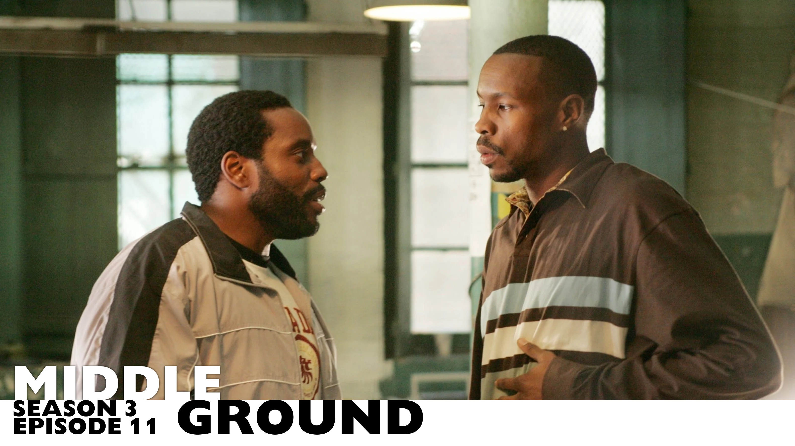
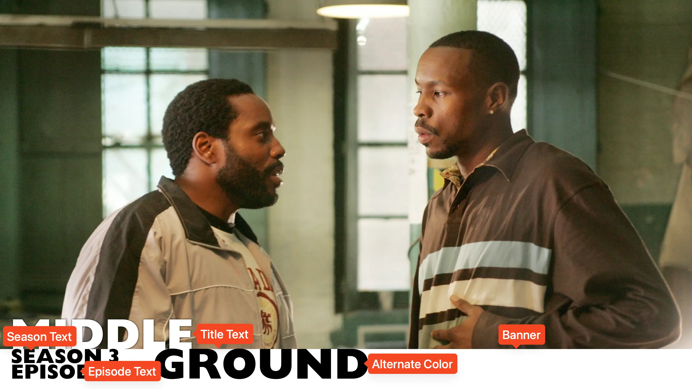

<link rel="stylesheet" type="text/css" href="https://unpkg.com/image-compare-viewer/dist/image-compare-viewer.min.css">

# Banner Card Type

This card design was created by [CollinHeist](https://github.com/CollinHeist),
and the design was inspired by graphic designer and TPDb contributor
[Danny Beaton](https://www.dannybeaton.com.au/).

These cards feature a solid-color banner at the bottom of the image, with all
text directly on top of or within the banner. The banner and text can all be
recolored and resized.

<figure markdown="span" style="max-width: 70%">
  
</figure>

??? note "Labeled Card Elements"

    

## Alternate Coloring

Text which is positioned above the banner will be colored according to the font
color, but text positioned inside the banner itself can be adjusted with the
_Alternate Color_ extra. This defaults to black so that there is sufficient
contrast against the default banner color of white.

This extra will also affect the coloring of the season and episode text.

??? example "Example"

    

        
        
    

## Banner Customization

### Color

The color of the banner can be adjusted with the _Banner Color_ extra. By
default, this matches the title text / font color.

??? example "Example"

    

        
        
    

### Height

The height of the banner can be adjusted with the _Banner Height_ extra.

??? example "Example"

    

        
        
    

### Toggle

The banner can be completely disabled by setting the _Disable Banner_ extra to
`True`.

If disabled, all text will still be positioned as if the banner is present, so
this is _generally_ not advised.

??? example "Example"

    

        
        
    

## Episode Text

Unless explicitly stated otherwise, all of the following extras will refer to
both the season _and_ episode text. "Episode text" is used for brevity.

### Color

The color of the season and episode text is controlled with the
[_Alternate Color_](#alternate-coloring) extra.

### Size

The size of the season and episode text can be adjusted with the
_Episode Text Font Size_ extra. Like all font sizes, values greater than
`#!yaml 1.0` will increase the size of the text, and values less than
`#!yaml 1.0` will decrease it.

??? example "Example"

    

        
        
    

## Horizontal Offset

The distance at which text is offset from the side of the card can be adjusted
with the _Horizontal Offset_ extra. Positive values _increase_ the spacing
between the text and the edge of the image, while negative values _decrease_ it.

??? example "Example"

    

        
        
    

## Mask Images

This card also natively supports [mask images](../user_guide/mask_images.md).
Like all mask images, TCM will automatically search for alongside the input
Source Image in the Series' source directory, and apply this atop all other Card
effects.

!!! example "Example"

    

        
        
    

