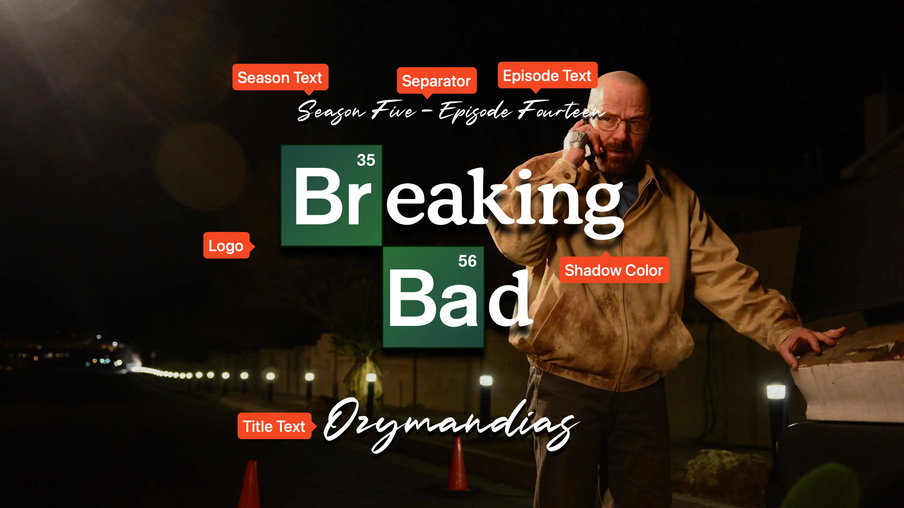

<link rel="stylesheet" type="text/css" href="https://unpkg.com/image-compare-viewer/dist/image-compare-viewer.min.css">

# Calligraphy Card Type

This card design was created by [CollinHeist](https://github.com/CollinHeist),
and the design was inspired by
[this](https://www.reddit.com/r/PlexTitleCards/comments/1699653/) set of title
cards for One Piece from
[/u/Recker_Man](https://www.reddit.com/user/Recker_Man).

These cards feature a prominent logo, with the index and title text above and
below. A calligraphy font is utilized for all text, and a grain / paper texture
is added (by default) to the image. It is recommended to use this with some
blurred or grayscale styling.

<figure markdown="span" style="max-width: 70%">
  
</figure>

??? note "Labeled Card Elements"

    

## Deep Blur Toggle

If the Card is being blurred as a result of an [unwatched
style](../user_guide/settings.md#watched-and-unwatched-episode-styles), TCM
automatically applies a stronger / more blurry effect to the Card to match the
'calligraphy on paper' aesthetic. This can be disabled by setting the _Deep
Blur Unwatched Toggle_ extra to `False`.

??? example "Example"

    

        
        
    

!!! note "Interaction with the Global Blur Profile Setting"

    If you have customized the blur profile of the Calligraphy card by adjusting
    the [global setting](../user_guide/settings.md#global-blur-profiles), then
    the custom blur profile will only take effect if this setting is _disabled_
    or if the Card is blurred for a _watched_ Episode.

## Episode Text

Unless explicitly stated otherwise, all of the following extras will refer to
both the season _and_ episode text. "Episode text" is used for brevity.

### Coloring

The color of the season and episode text can be adjusted with the _Episode Text
Color_ extra. If unspecified, this defaults to match the color of the title
text.

??? example "Example"

    

        
        
    

### Size

The size of the season and episode text can be adjusted with the _Episode Text
Font Size_ extra. Like all font sizes, values greater than `#!yaml 1.0` will
increase the size of the text, and values less than `#!yaml 1.0` will decrease
it.

??? example "Example"

    

        
        
    

## Logo Size

If a logo file is supplied and available, that file will be added to the center
of the card. The size of this logo can be adjusted with the _Logo Size_ extra.
Like all sizes, values greater than `#!yaml 1.0` will increase the size of the
image, and values less than `#!yaml 1.0` will decrease it.

Adjusting this size will also change where the [Episode Text](#episode-text) is
positioned, as TCM moves that text just above the bounds of the logo.

??? example "Example"

    

        
        
    

## Separator Character

If both the season and episode text are displayed on the Card, then a separator
character is added between them. This character can be adjusted with the
_Separator Character_ extra.

The color of this character will be controlled by the
[_Episode Text Color_](#coloring) extra.

??? example "Example"

    

        
        
    

## Shadow Color

Rather than a stroke, TCM adds a drop shadow to all elements on this card in
order to improve legibility. The color of this shadow can be changed with the
_Shadow Color_ extra.

??? example "Example"

    

        
        
    

## Texture Customization

By default, TCM adds a "texture" overlay image to all Cards of this type. This
is done to enhance the calligraphic-effect.

### Randomization

To add a slight variation between cards, TCM optionally varies the texture
overlay before it is applied. This can be disabled by setting the _Texture
Randomization Toggle_ extra to `False`.

### Toggle

Whether the texture is added at all can be configured with the _Texture Toggle_
extra. If this is specified as `False`, then the texture overlay will not be
applied.

??? example "Example"

    

        
        
    

## Title Offset

TCM automatically applies an "offset" to some multi-line titles to give the
stylized appearance of the two lines not being centered in the page. This can be
disabled by setting the _Offset Title Toggle_ extra to `False`.

??? example "Example"

    

        
        
    

## Mask Images

This card also natively supports [mask images](../user_guide/mask_images.md).
Like all mask images, TCM will automatically search for alongside the input
Source Image in the Series' source directory, and apply this atop all other Card
effects.

!!! example "Example"

    

        
        
    

