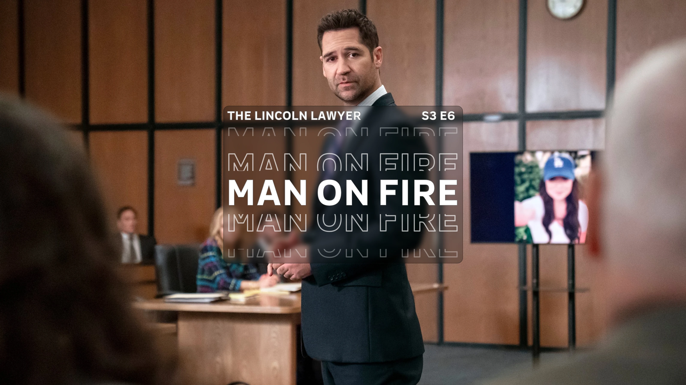
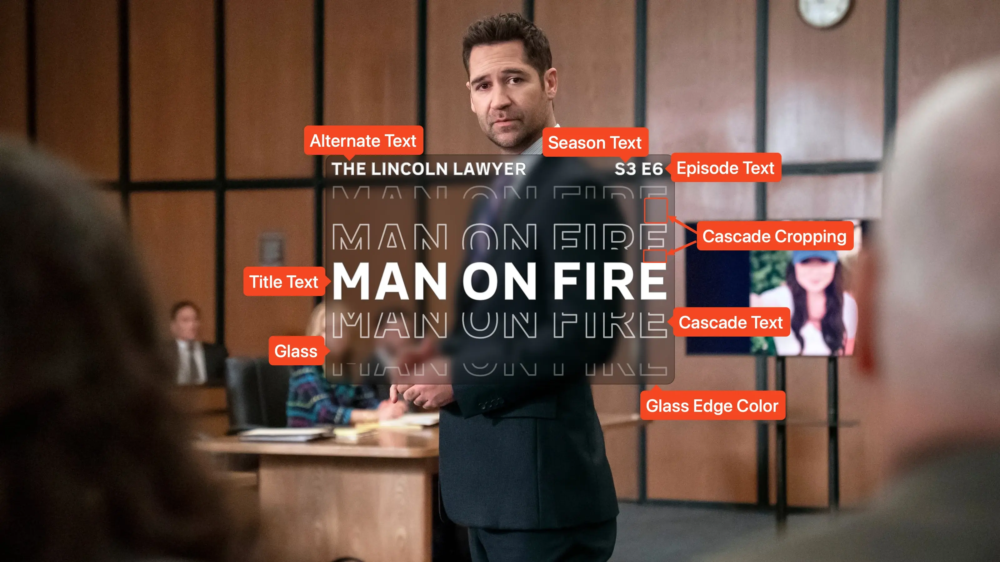

<link rel="stylesheet" type="text/css" href="https://unpkg.com/image-compare-viewer/dist/image-compare-viewer.min.css">

# Cascade Card Type

This card design was created by [CollinHeist](https://github.com/CollinHeist),
and the design was inspired by
[this](https://www.youtube.com/watch?v=JEJt009r3cg) YouTube video by _Macho
Nacho Productions_.

Cards of this style feature a variable number of cascading outlines of text. The
color, count, and visual styling of the cascading text can be changed with
extras.

<figure markdown="span" style="max-width: 70%">
  
</figure>

??? note "Labeled Card Elements"

    

## Alternate Text

This card features adjustable text called the "Alternate Text." The following
extras all relate to this text.

### Coloring

The color of the alternate text can be adjusted with the _Alterate Text Color_
extra. When unspecified, this defaults to match the
[_Episode Text Color_](#coloring-1); if that is unspecified then the color
defaults to match the Font color.

??? example "Example"

    

        
        
    

### Format

The actual content of the alternate text can be adjusted with the _Alternate
Text Format_ extra. This is a format string, meaning all available
[variables](../user_guide/variables.md) can be used to adjust the text. By
default, this text will be the series name.

In order to completely remove the text, this extra can be specified as `""`.

??? example "Example"

    

        
        
    

    

        
        
    

## Cascade Effect

### Count

The number of cascading text elements which appear above and below the title
text can be adjusted with the _Cascade Text Count_ extra.

To disable the cascading text completely, this extra should be set to `0`.

??? example "Example"

    

        
        
    

### Cropping

How much each part of the cascading text is cropped can be adjusted with the
_Cascade Cropping_ extra. This takes comma-separated numbers (as percentages)
which indicate how much of the text should _remain_ after cropping. For example,
`80,40` will leave 80% (cropping out 20%) of the first cascade (the one closest
to the middle of the image); and leave 40% (cropping out 60%) of the second.

!!! tip "Advanced Formula"

    In addition to being able to specify the exact amount, this extra also
    supports more advanced "formulas" to crop in more sophisticated ways. Any of
    the crop values can take the form of `{operation}{number}` - e.g. `+30`,
    `/1.3`, `*3` -  and this will apply that operation to all subsequent crops.
    See the following example for more information.

    ??? example "Example Formula"

        The default cropping "formula" is `66,/2`. This means the first cascade
        will leave 66% uncropped, and all subsequent cascades will be half that.
        If the [Cascade Text Count](#count) was 5, this would be `66`, `33`,
        `16.5`, `8.25`, and `4.125`.

        `100,-20` would crop to `100`, `80`, `60`, etc.

It is important to note that TCM will mark the setting as invalid (and fail to
create the Card) if any cropping value is below `0` or above `100`.

??? example "Example"

    

        
        
    

### Fill Color

The filled color of the cascading text can be adjusted with the _Cascade Text
Fill Color_ extra. By default, the text is not filled in (with the color set to
`transparent`.)

??? example "Example"

    

        
        
    

### Outline Color

The outline color of the cascading text can be adjusted with the _Cascade Text
Outline Color_ extra.

??? example "Example"

    

        
        
    

### Outline Width

The width of the cascade text outline can be adjusted with the _Cascade Text
Outline Width_ extra.

Although this _can_ be set to `0` - effectively hiding the outline - it is
instead recommended to set the [Cascade Text Outline Color](#outline-color) to
something like `transparent`.

??? example "Example"

    

        
        
    

### Transparency

How transparent each part of the cascading text is can be adjusted with the
_Cascade Transparencies_ extra. This takes comma-separated numbers (as
percentages) which indicate how opaque the text should be. For example, `80,40`
will make the first cascade (the one closest to the middle of the image) 80%
opaque (20% see-through), and the second as 40% opaque.

!!! tip "Advanced Formula"

    In addition to being able to specify the exact amount, this extra also
    supports more advanced "formulas" to apply transparency in more
    sophisticated ways. Any of the transparencies can take the form of
    `{operation}{number}` - e.g. `+30`, `/1.3`, `*3` -  and this will apply that
    operation to all subsequent transparencies. See the following example for
    more information.

    ??? example "Example Formula"

        The default transparency "formula" is `66,/2`. This means the first
        cascade will be 66% opaque, and all subsequent cascades will be half
        that. If the [Cascade Text Count](#count) was 5, this would be `66`,
        `33`, `16.5`, `8.25`, and `4.125`.

        `100,-20` would scale to `100`, `80`, `60`, etc.

It is important to note that TCM will mark the setting as invalid (and fail to
create the Card) if any transparency value is below `0` or above `100`.

??? example "Example"

    

        
        
    

## Episode Text

Unless explicitly stated otherwise, all of the following extras will refer to
both the season _and_ episode text. "Episode text" is used for brevity.

### Coloring

The color of the episode text can be adjusted with the _Episode Text Color_
extra. If unspecified, this defaults to match the color of the title text.

??? example "Example"

    

        
        
    

### Size

The size of the season and episode text can be adjusted with the
_Episode Text Font Size_ extra. Like all font sizes, values greater than
`#!yaml 1.0` will increase the size of the text, and values less than
`#!yaml 1.0` will decrease it.

This will also adjust the size of the _Alternate Text_.

??? example "Example"

    

        
        
    

## Glass

This card contains a semi-transparent "glass" element behind all text in order
to make the text appear more visible on some images. The following extras all
address this element.

### Edge Color

The edge of the glass can be adjusted with the _Glass Edge Color_ extra. If you
want to make the edge blend with the rest of the glass, this can be set to match
the [Glass Color](#fill-color).

??? example "Example"

    

        
        
    

### Fill Color

The filled color of the glass can be adjusted with the _Glass Color_ extra. It
is recommended to keep this as an image with some transparency, so that the
underlying image is visible beneath.

??? example "Example"

    

        
        
    

### Toggle

The glass itself can be disabled by setting the _Glass Toggle_ extra to `False`.

??? example "Example"

    

        
        
    

## Mask Images

This card also natively supports [mask images](../user_guide/mask_images.md).
Like all mask images, TCM will automatically search for alongside the input
Source Image in the Series' source directory, and apply this atop all other Card
effects.

!!! example "Example"

    

        
        
    

