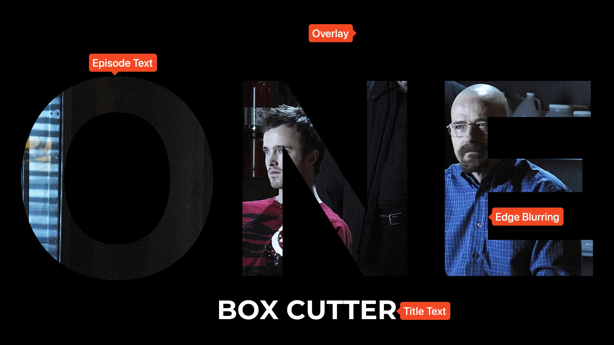

<link rel="stylesheet" type="text/css" href="https://unpkg.com/image-compare-viewer/dist/image-compare-viewer.min.css">

# Cutout Card Type

This card design was based on Reddit user
[/u/Phendrena](reddit.com/u/Phendrena)'s Willow Title Card set, and was created
by [CollinHeist](https://github.com/CollinHeist). These cards feature a solid
color overlay, with large episode text cut out to reveal the underlying image.

<figure markdown="span" style="max-width: 70%">
  
</figure>

??? note "Labeled Card Elements"

    

## Overlay

The primary feature of this card is the solid color overlay which covers a
majority of the image. This can be customized with various Extras.

### Color

The color of the overlay can be adjusted with the _Overlay Color_ extra. This
can any color, but any transparency (like `rgba(15, 15, 15, 0.4)`) will not
be properly applied - this should be done with the [Overlay
Transparency](#transparency) Extra.

??? example "Example"

    

        
        
    

### Transparency

How transparent the overlay color is can be adjusted with the _Overlay
Transparency_ extra. This is a number between 0 and 1, with larger values
resulting in more transparency.

??? example "Example"

    

        
        
    

## Overlay Edge

### Blurring

Whether the edge of the cutout text is blurred or not can be adjusted with the
_Edge Blurring_ extra. If disabled (the default), there will be sharp lines in
the overlay.

??? example "Example"

    

        
        
    

### Blur Profile

If edge blurring is [enabled](#blurring), then the specific "profile" - i.e. how
blurry to draw the edges - can be adjusted with the _Blur Profile_ extra. This
takes an argument identical to the [global blur
profile](../user_guide/settings.md#global-blur-profiles) setting.

??? example "Example"

    

        
        
    

## Cutout Vertical Shift

The vertical position of the cutout text can also be adjusted. By default, TCM
places the text in the center of the image.

??? example "Example"

    

        
        
    

## Mask Images

This card also natively supports [mask images](../user_guide/mask_images.md).
Like all mask images, TCM will automatically search for alongside the input
Source Image in the Series' source directory, and apply this atop all other Card
effects.

!!! example "Example"

    

        
        
    

