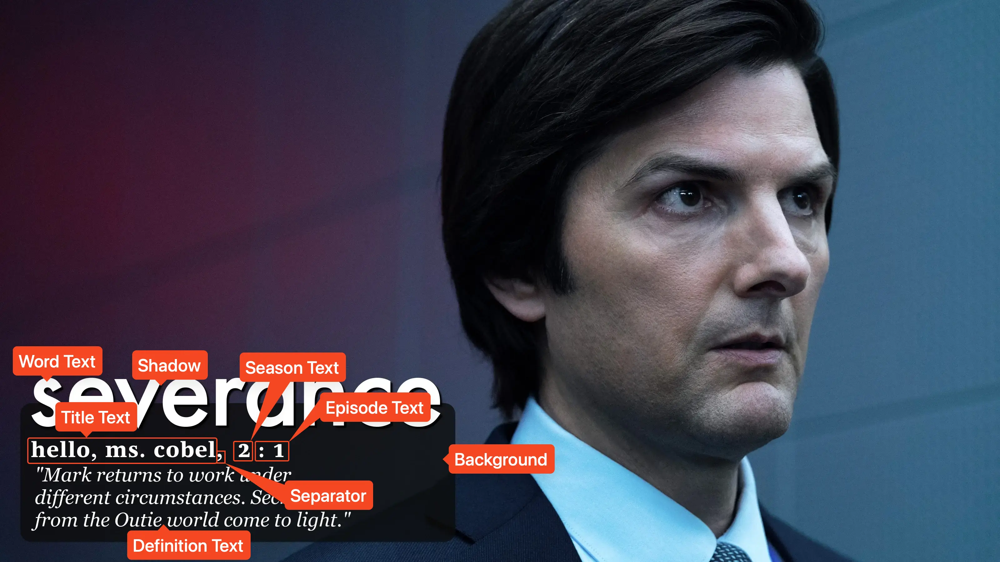

<link rel="stylesheet" type="text/css" href="https://unpkg.com/image-compare-viewer/dist/image-compare-viewer.min.css">

# Dictionary Card Type

This card design was created by [CollinHeist](https://github.com/CollinHeist),
and was inspired by the text annotations in
[this video](https://www.youtube.com/watch?v=gcS1HIci4hQ) by _Any Austin_.

Cards of this design are intended to resemble a dictionary definition - and so
most extras resolve around manipulating the "word" (series name), "label"
(title), and "definition" (Episode description).

<figure markdown="span" style="max-width: 70%">
  
</figure>

??? note "Labeled Card Elements"

    

## Background Color

The color of the background box can be adjusted with the _Background Color_
extra.

??? example "Example"

    

        
        
    

## Definition Text

### Color

The color of the defintion text can be adjusted with the _Definition Color_
extra. If unspecified, this defaults to matching the color of the title text.

??? example "Example"

    

        
        
    

### Italicize Toggle

The definition text is italicized by default. This can be turned off by setting
_Italicize Definition Toggle_ to `False`.

??? example "Example"

    

        
        
    

### Line Limits

The definition text will be dynamically split into multiple lines in order to
fit the width of the rectangle. The maximum number of lines of displayed text
can be adjusted with the _Definition Line Limit_ extra.

If the number of lines is longer than this limit then the definition text will
be truncated and `[...]` will be added to the end.

??? example "Example"

    

        
        
    

### Quotes

By default, quotes are added around the definition text. This can be disabled by
setting the _Quote Definition Toggle_ extra to `False`.

??? example "Example"

    

        
        
    

### Size

The size of the definition text can be adjusted with the _Definition Font Size_
extra. Like all font sizes, values greater than `#!yaml 1.0` will increase the
size of the text, and values less than `#!yaml 1.0` will decrease it.

??? example "Example"

    

        
        
    

### Text

The text itself can be adjusted with the _Defintion Text_ extra.

!!! tip "Automatically Pull Episode Descriptions"

    If left as the default (or any [Format String](../user_guide/variables.md)
    which includes the variable `{episode_description}`, e.g.
    `{episode_description.lower()}`), then TCM will automatically search
    [TMDb](../user_guide/connections.md#themoviedatabase) for an Episode
    description/overview.

    This can be disabled by either setting this Extra to the text you wish to
    display _or_ disabling the text altogether by specifying `""`.

??? example "Example"

    

        
        
    

## Position

The overall position of the background and all text elements can be adjusted
with the _Position_ extra. This needs to be formatted like `+x+y`, where the `x`
and `y` values are how far from the bottom left corner of the image. Technically
you can specify negative x or y values (i.e. `-100-100`), but this will
partially obscure the content.

??? example "Example"

    

        
        
    

## Separator Character

The separator character is used to join the title and season/episode text. This
can be adjusted with the _Separator Character_ extra. To remove this character
completely, specify `""`.

??? example "Example"

    

        
        
    

## Word Text

### Color

The color of the word text can be adjusted with the _Word Text Color_ extra. If
unspecified, this color defaults to matching the color of the title text.

??? example "Example"

    

        
        
    

### Size

The size of the definition text can be adjusted with the _Word Text Font Size_
extra. Like all font sizes, values greater than `#!yaml 1.0` will increase the
size of the text, and values less than `#!yaml 1.0` will decrease it.

Be aware that decreasing the size of the word text may result in truncating more
of the definition text.

??? example "Example"

    

        
        
    

### Text

The text used in the "word" position itself can be adjusted with the _Word Text_
extra. This field supports [Format Strings](../user_guide/variables.md), and the
default value (`{series_name.lower()}`) will add the series name in lowercase
text.

??? example "Example"

    

        
        
    

## Mask Images

This card also natively supports [mask images](../user_guide/mask_images.md).
Like all mask images, TCM will automatically search for alongside the input
Source Image in the Series' source directory, and apply this atop all other Card
effects.

!!! example "Example"

    

        
        
    

