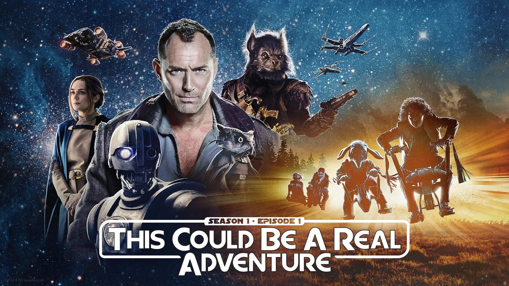

# Custom Card Types

## Background

In addition to customizing individual parts of a Title Card like the text,
styling, and font, TitleCardMaker is designed to support multiple different
types of Title Cards. These different types vary in more fundamental ways such
as layout, text placement, and additional features.

There are three different categories of card types:

Built-in

:   Card types developed by yours truly and shipped as part of TitleCardMaker.
    These types are typically the most thoroughly tested and support all the
    features of TitleCardMaker.

User-made

:   Cards developed by users of TCM who have taken the effort to make these
    available for others. These cards are not officially maintained, and so are
    not guaranteed to support all features. These are downloaded while TCM is
    running from the
    [card types repository](https://github.com/CollinHeist/TitleCardMaker-CardTypes).

Local

:   Cards as Python files that exist on your local machine and are only
    available to yourself. These are read and loaded dynamically when TCM
    launches (and periodically after that). These can be used to test cards as
    they are being developed, but do require a little but of Python knowledge.

## Built-in Cards

TitleCardMaker currently has the following built-in card types:

-   
    [Anime](./anime.md)

-   
    [Anime Fade](./anime_fade.md)

-   
    [Banner](./banner.md)

-   
    [Calligraphy](./calligraphy.md)

-   
    [Cascade](./cascade.md)

-   
    [Comic Book](./comic_book.md)

-   
    [Cutout](./cutout.md)

-   
    [Dictionary](./dictionary.md)

-   
    [Divider](./divider.md)

-   
    [Fade](./fade.md)

-   
    [Formula 1](./f1.md)

-   
    [Frame](./frame.md)

-   
    [Graph](./graph.md)

-   
    [Inset](./inset.md)

-   
    [Landscape](./landscape.md)

-   
    [Logo](./logo.md)

-   
    [Marvel](./marvel.md)

-   
    [Music](./music.md)

-   
    [Negative Space](./negative_space.md)

-   
    [Notification](./notification.md)

-   
    [Olivier](./olivier.md)

-   
    [Overline](./overline.md)

-   
    [Poster](./poster.md)

-   
    [Roman Numeral](./roman_numeral.md)

-   
    [Score](./score.md)

-   
    [Shape](./shape.md)

-   
    [Skeleton Crew](./skeleton_crew.md)

-   
    [Star Wars](./star_wars.md)

-   
    [Standard](./standard.md)

-   
    [Striped](./striped.md)

-   
    [Tinted Frame](./tinted_frame.md)

-   
    [Tinted Glass](./tinted_glass.md)

-   
    [White Border](./white_border.md)

## User-made Cards

...

## Local Cards

The details of developing local card types is described [here](./local.md).
