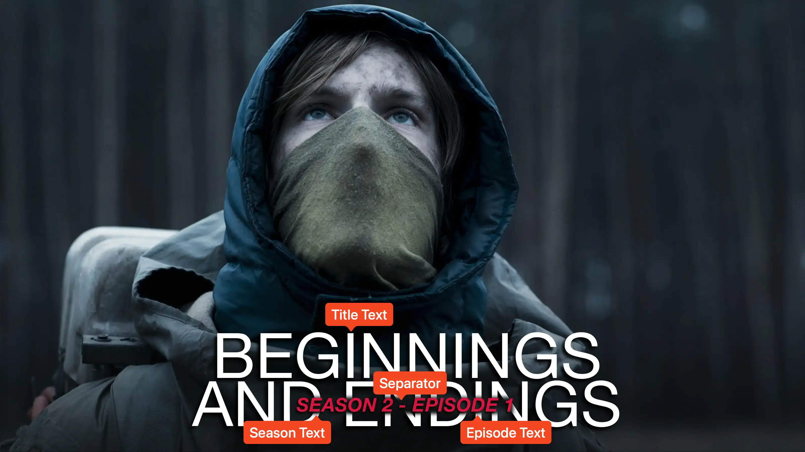

<link rel="stylesheet" type="text/css" href="https://unpkg.com/image-compare-viewer/dist/image-compare-viewer.min.css">

# Inset Card Type

This card design was created by [CollinHeist](https://github.com/CollinHeist).

This card type shows the season and episode text **inset into** the title text:
the index text appears to "cut out" of the title, with a window of the source
image (styled to match the card) visible behind it. The title sits at the
bottom with a drop shadow, and supports custom fonts and custom season titles.

<figure markdown="span" style="max-width: 70%">
  
</figure>

??? note "Labeled Card Elements"

    

## Episode Text

Unless _explicitly_ stated otherwise, "episode text" here refers to both the
season and episode text (the inset index).

This card will position the episode text in the middle of the title text. If
there are multiple lines of title text, it will be positioned in the middle of
the bottom line.

### Color

The color of the inset index text can be adjusted with the _Episode Text Color_
extra.

??? example "Example"

    

        
        
    

### Font Size

The size of the inset text can be adjusted with the _Episode Text Font Size_
extra. Values greater than `#!yaml 1.0` increase the size; values less than
`#!yaml 1.0` decrease it.

??? example "Example"

    

        
        
    

## Separator Character

When both season and episode text are shown, a separator is placed between them.
The _Separator Character_ extra controls this character. The default is a dash.

??? example "Example"

    

        
        
    

## Inset Text Transparency

The _Inset Text Transparency_ extra controls how opaque the "cut-out" background
is—i.e. the patch of source image visible behind the index text. A value of
`#!yaml 1.0` (default) is fully opaque; `#!yaml 0.0` is fully transparent.

??? example "Example"

    

        
        
    

## Gradient Overlay

A gradient is applied over the source image by default to improve legibility. It
can be removed by setting the _Gradient Omission_ extra to `True`. Removing
this gradient only affects the image gradient overlay - the dropshadow of the
text is not affected.

!!! warning "Text legibility"

    With the gradient omitted, text may be harder to read on bright images.

??? example "Example"

    

        
        
    

## Mask Images

This card also natively supports [mask images](../user_guide/mask_images.md).
Like all mask images, TCM will automatically search for alongside the input
Source Image in the Series' source directory, and apply this atop all other Card
effects.

!!! example "Example"

    

        
        
    

