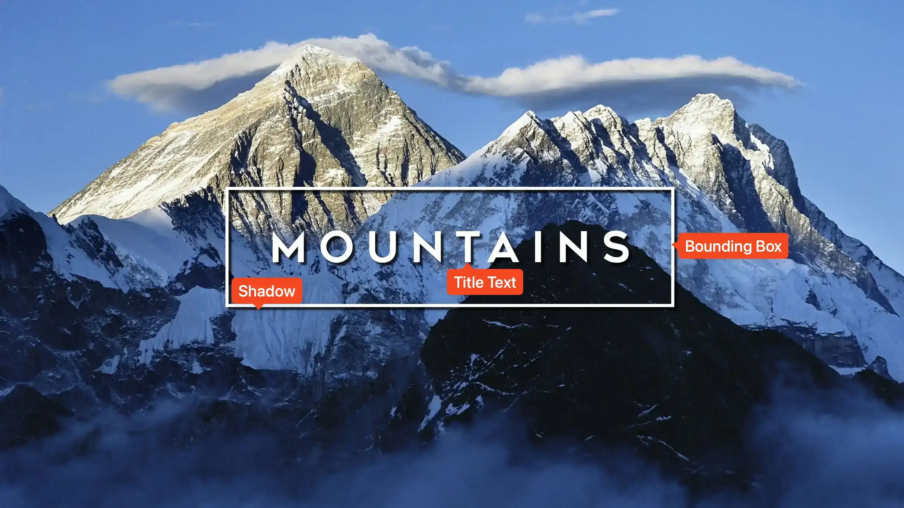

<link rel="stylesheet" type="text/css" href="https://unpkg.com/image-compare-viewer/dist/image-compare-viewer.min.css">

# Landscape Card Type

This card design was created by [CollinHeist](https://github.com/CollinHeist),
and was inspired by the logo for _Lessons in Chemistry_.

This card type is **title-centric** and does not show any season or episode
text. The title is centered and can be wrapped in box. It is aimed at
landscape-heavy images (e.g. nature documentaries like _Planet Earth_) where a
typical portrait crop would hide faces.

<figure markdown="span" style="max-width: 70%">
  
</figure>

??? note "Labeled Card Elements"

    

## Bounding Box

A bounding box can be drawn around the title. By default it is on; its look and
behavior are controlled by the extras below.

### Toggle

The _Box Toggle_ extra turns the bounding box on or off. `True` (default) draws
the box; `False` hides it.

??? example "Example"

    

        
        
    

### Adjustments

The _Box Adjustments_ extra shifts each side of the box. Use four numbers in
order: **top**, **right**, **bottom**, **left** (e.g. `-20 10 0 5`). Positive
values move that edge outward; negative values move it inward. The default is
`#!yaml 0 0 0 0`.

??? example "Example"

    

        
        
    

### Color

The _Box Color_ extra sets the stroke color of the bounding box. If unset, it
defaults to the title (font) color.

??? example "Example"

    

        
        
    

### Width

The _Box Width_ extra sets the line thickness of the box in pixels. The default
is `#!yaml 10`.

??? example "Example"

    

        
        
    

### Rounding Radius

The _Box Rounding Radius_ extra adjusts the roundness of the corners of the box.
Values are in pixels from `#!yaml 0` (square) to `#!yaml 500`.

??? example "Example"

    

        
        
    

### Blurring

#### Toggle

The area behind the bounding box can be blurred with the _Box Blurring_ extra.
Setting this to `True` will blur this area, while `False` (the default) will
keep the part of the image unaltered.

??? example "Example"

    

        
        
    

#### Profile

If blurring is [enabled](#toggle), then the _Blur Profile_ extra can be used to
adjust the "strength" of the blur. This is specified like `{radius}x{sigma}`;
where a higher sigma increases the strength of the blur effect.

??? example "Example"

    

        
        
    

## Image Darkening

To improve readability on bright images, the card can darken part or all of the
image.

### Toggle

The _Image Darkening_ extra adjusts the behavior of the darkening functionality.
This can be set to:

- **`box`** (default): darken only the bounding box area
- **`all`**: darken the whole image
- **`False`**: no darkening

??? example "Example"

    

        
        
    

### Color

The _Darken Color_ extra sets the overlay color. The default is black at 30%
opacity.

??? example "Example"

    

        
        
    

## Shadow Color

The color of the title’s drop shadow is set with the _Shadow Color_ extra. The
default is `black`.

??? example "Example"

    

        
        
    

## Mask Images

This card also natively supports [mask images](../user_guide/mask_images.md).
Like all mask images, TCM will search for them next to the source image in the
series directory and apply them on top of all other card effects.

!!! example "Example"

    

        
        
    

