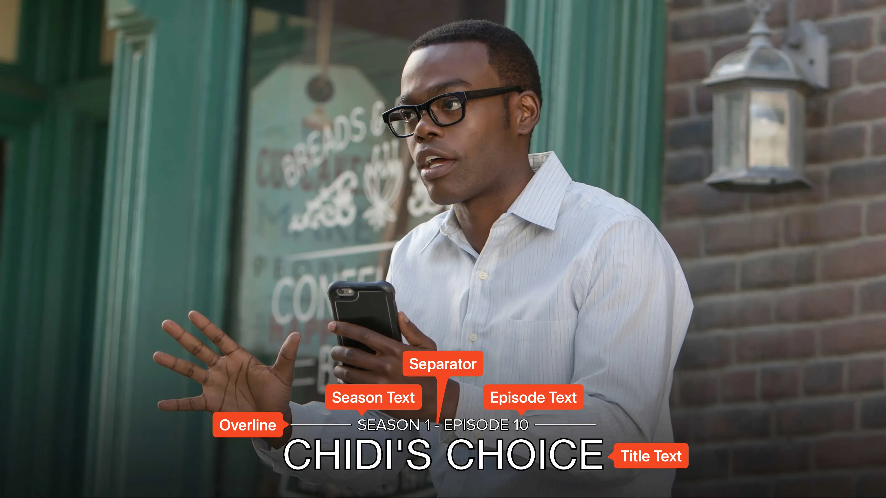
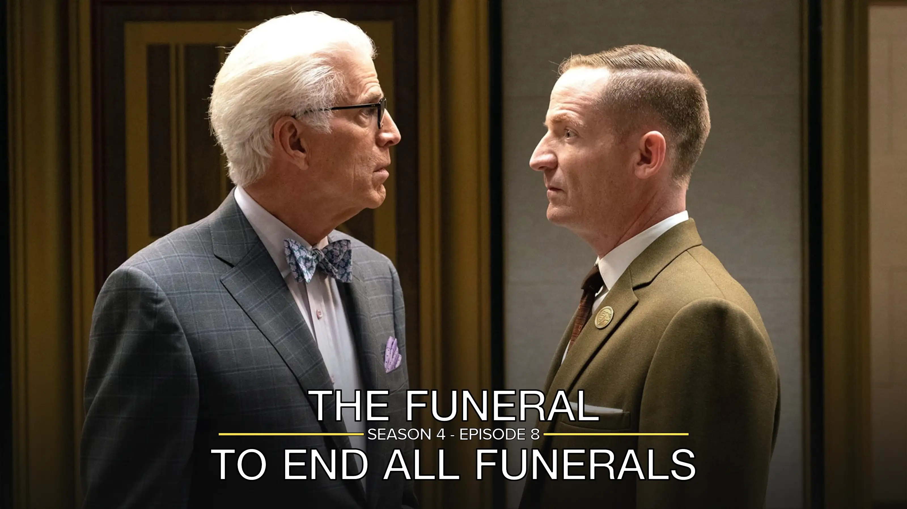
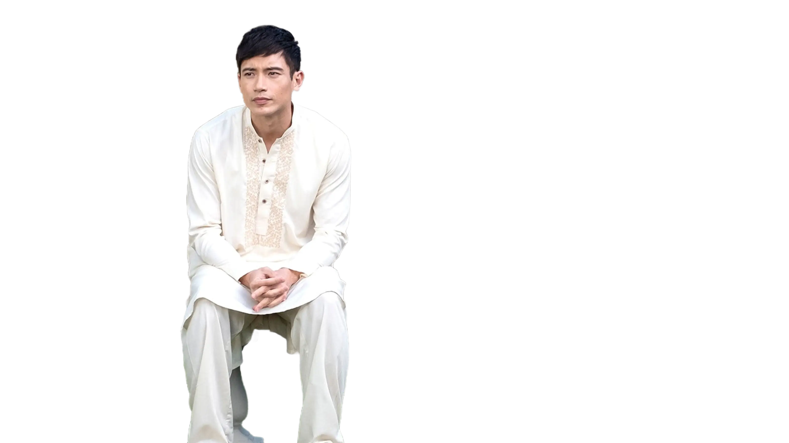
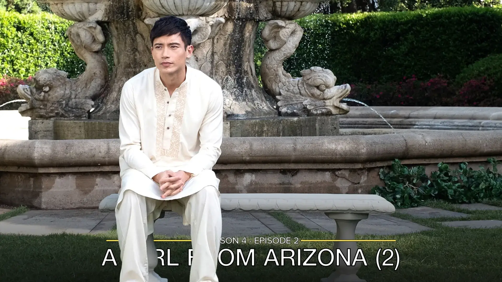

<link rel="stylesheet" type="text/css" href="https://unpkg.com/image-compare-viewer/dist/image-compare-viewer.min.css">

# Overline Card Type

This card design was created by [CollinHeist](https://github.com/CollinHeist).

This is a simple title card with the title and index text positioned at the
bottom of the image. A thin horizontal line is drawn above (or below) the title
text and is interrupted in the center by the index text, creating a split
overline effect.

<figure markdown="span" style="max-width: 70%">
  
</figure>

??? note "Labeled Card Elements"

    

## Episode Text

Unless _explicitly_ stated otherwise, "episode text" here refers to the combined
season and episode index text displayed in the gap of the line (e.g.
`SEASON 1 - EPISODE 1`).

!!! note "Wide Episode Text"

    If the episode text being added to the Card is _wider_ than the width of the
    title text (minus some margin), then TCM will not draw the "overline" line
    at all.

### Color

The color of the index text can be adjusted with the _Episode Text Color_
extra. If unspecified, it defaults to matching the font color.

??? example "Examples"

    

        
        
    

### Size

The size of the index text can be adjusted with the _Episode Text Font Size_
extra. Values above `#!yaml 1.0` increase the size of the text, and values below
`#!yaml 1.0` decrease it.

??? example "Examples"

    

        
        
    

## Line

The horizontal line can be repositioned, recolored, resized, or hidden entirely.

### Color

The color of the line can be adjusted with the _Line Color_ extra. If
unspecified, it defaults to matching the episode text or font color.

??? example "Examples"

    

        
        
    

### Position

The position of the line and index text relative to the title text can be
adjusted with the _Line Position_ extra. This can be set to `top` (default) or
`bottom`.

When set to `top`, the line sits above the title text and the index text appears
above the title. When set to `bottom`, the line sits below the title text and
the index text appears below the title.

??? tip "Multi-Line Titles"

    If a title is split across multiple lines and the _Line Position_ is set to
    `top`, then the line and text will be positioned between the bottom two
    lines of text - see the example below.

    

??? example "Examples"

    

        
        
    

### Width

The thickness of the line can be adjusted with the _Line Width_ extra. The
default is `9` pixels.

??? example "Examples"

    

        
        
    

### Visibility

The line can be hidden entirely by setting the _Line Toggle_ extra to `True`.

??? example "Examples"

    

        
        
    

## Separator Character

When both season and episode text are shown, a separator is placed between them.
The _Separator Character_ extra controls this character. The default is a dash.

??? example "Examples"

    

        
        
    

## Gradient Overlay

A gradient is applied over the source image by default to improve legibility. It
can be removed by setting the _Gradient Omission_ extra to `True`.

!!! warning "Text legibility"

    With the gradient omitted, text may be harder to read on bright images.

??? example "Examples"

    

        
        
    

## Mask Images

This card also natively supports [mask images](../user_guide/mask_images.md).
Like all mask images, TCM will automatically search for alongside the input
Source Image in the Series' source directory, and apply this atop all other Card
effects.

!!! example "Example"

    

        
        
    

