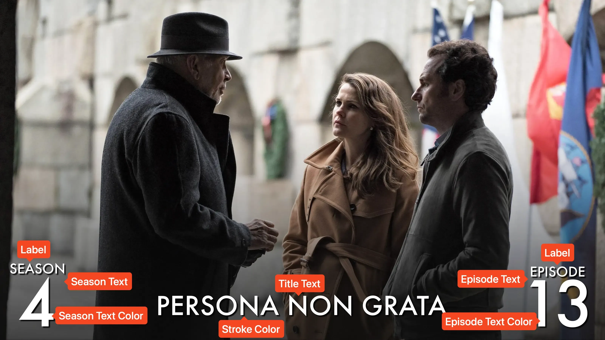

<link rel="stylesheet" type="text/css" href="https://unpkg.com/image-compare-viewer/dist/image-compare-viewer.min.css">

# Score Card Type

This card design was created by [CollinHeist](https://github.com/CollinHeist),
and the design was inspired by
[this](https://www.everymanjack.com/products/28-8oz-3-in-1-all-over-wash?variant=43908560388258)
shampoo bottle I saw at the grocery store.

Cards of this style resemble a game score (hence the name), and feature a
prominent centered title, with the season and episode text in the corners of the
image. All text can be re-positioned and colored with extras.

<figure markdown="span" style="max-width: 70%">
  
</figure>

??? note "Labeled Card Elements"

    

## Episode Text

Unless explicitly stated otherwise, all of the following extras will refer to
both the season _and_ episode text. "Episode text" is used for brevity.

### Coloring

The color of the episode text can be adjusted with the _Episode Text Color_
extra. If unspecified, this defaults to match the color of the title text. This
will also color the season text, unless
[explicity adjusted](#season-text-color).

This extra can either be a single color (with no spaces) - e.g. `red` to color
the season label (such as `EPISODE`) and the number (`13`) the same color; or this
extra can be two space separated colors to adjust these individually. See the
examples below.

??? example "Example"

    

        
        
    

    

        
        
    

### Horizontal Shift

The horizontal position of the episode text can be adjusted with the _Episode
Text Horizontal Shift_ extra. This will change how far in from the edge of the
image the episode text will placed. Positive values move the text towards the
center of the image, and negative values move it away.

If using the `surround` [_Variation_](#variation), then the two texts will be
moved in the opposite direction.

??? example "Example"

    

        
        
    

### Position

The position of the episode text can be adjusted with the
[card layout](#card-layout) extras.

### Size

The size of the season and episode text can be adjusted with the
_Episode Text Font Size_ extra. Like all font sizes, values greater than
`#!yaml 1.0` will increase the size of the text, and values less than
`#!yaml 1.0` will decrease it.

??? example "Example"

    

        
        
    

### Vertical Shift

The vertical position of the season and episode text can be adjusted with the
_Episode Text Vertical Shift_ extra. Positive values will move the text(s)
towards the center of the image, negative values towards the outside.

??? example "Example"

    

        
        
    

## Gradient Overlay

By default, TCM applies a subtle gradient overlay on top of the source image so
that the (default) white text appears more legible. If you would like to remove
this gradient overlay, set the _Gradient Omission_ extra to `True`.

??? example "Example"

    

        
        
    

## Season Text Color

Like the [episode text](#episode-text), the color of the season text can be
adjusted with the _Season Text Color_ extra. If unspecified, this defaults to
the [episode text color](#coloring).

Like the _Episode Text Color_ extra, this extra can either be a single color
(with no spaces) - e.g. `red` to color the season label (e.g. `SEASON`) and the
number (`4`) the same color; or this extra can be two space separated colors to
adjust these individually. See the examples below.

??? example "Example"

    

        
        
    

    

        
        
    

## Stroke Color

The color of the stroke (technically shadow) can be adjusted with the
_Stroke Color_ extra. This affects the shadow colors of all text (season,
episode, and title) at the same time.

??? example "Example"

    

        
        
    

## Card Layout

### Label Placement

The position of the label (i.e. `SEASON` or `EPISODE`) _relative to the number_
can be adjusted with the _Label Placement_ extra. This can be `above` to put the
label above the number, `below` to place it below, and `random` to instruct TCM
to randomize the placement each time a Card is created.

??? example "Example"

    

        
        
    

### Text Placement

The overall position of all text (season, episode, and title text) can be
adjusted with the _Text Placement_ extra. This can be `top` to use the top of
the image, `bottom` to place on the bottom, and `random` to instruct TCM to
randomize the placement each time a Card is created.

In addition to adjusting the position of the text, TCM will also rotate the
gradient overlay (if not [disabled](#gradient-overlay)) to match the orientation
of the text.

??? example "Example"

    

        
        
    

### Variation

The "variation" (or layout) of the text in a given position can be adjusted with
the _Variation_ extra. This can be `left` to place the season and episode text
on the left side of the card; `right` to place them on the right; or `surround`
to place them on either side of the card.

When using an off-center variation (`left` or `right`), TCM will also reposition
the title text itself to be equally off-center.

!!! note "Swapping Season and Episode Text"

    If you want to swap the position of the season and episode text - i.e. move
    the season text to the right of the episode text - then you will need to
    adjust the season and episode text themselves.

??? example "Example"

    

        
        
    

    

        
        
    

## Title Text

### Horizontal Shift

By default, TCM centers the title text in the image, and if a non-surround
[variation] is used, then TCM adjusts that "center" position accordingly.
However, the horizontal offset of the title text can be manually adjusted with
the _Title Text Horizontal Shift_ extra.

??? example "Example"

    

        
        
    

### Position

The general vertical positioning of the title text can be adjusted with the
[_Text Placement_](#text-placement) extra.

## Mask Images

This card also natively supports [mask images](../user_guide/mask_images.md).
Like all mask images, TCM will automatically search for alongside the input
Source Image in the Series' source directory, and apply this atop all other Card
effects.

!!! example "Example"

    

        
        
    

