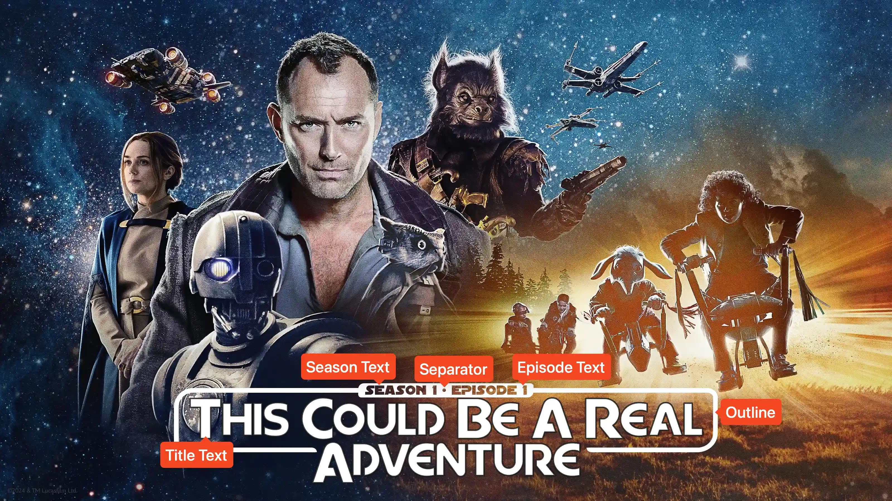

<link rel="stylesheet" type="text/css" href="https://unpkg.com/image-compare-viewer/dist/image-compare-viewer.min.css">

# Skeleton Crew Card Type

This card design was created by [Supremicus](https://github.com/Supremicus),
and the design was inspired by the official logo for _Star Wars: Skeleton Crew_.

Cards of this style feature a centered title element with a rounded rectangular
border around the text. The color and vertical position of the text elements can
all be changed with extras.

<figure markdown="span" style="max-width: 70%">
  
</figure>

??? note "Labeled Card Elements"

    

## Episode Text

Unless explicitly stated otherwise, all of the following extras will refer to
both the season _and_ episode text. "Episode text" is used for brevity.

### Coloring

The color of the episode text can be adjusted with the _Episode Text Color_
extra. By default, this is set to `transparent`, which just cuts out the text
from the border box.

??? example "Example"

    

        
        
    

### Size

The size of the season and episode text can be adjusted with the
_Episode Text Font Size_ extra. Like all font sizes, values greater than
`#!yaml 1.0` will increase the size of the text, and values less than
`#!yaml 1.0` will decrease it.

This will also adjust the size of the _Alternate Text_.

??? example "Example"

    

        
        
    

## Outline

### Color

The color of the outline can be adjusted with the _Outline Color_. If
unspecified, this defaults to matching the color of the title text.

??? example "Example"

    

        
        
    

### Width

The width of the outline (at least the portion which does not surround the
[Episode Text](#episode-text)) can be changed with the _Outline Width_ extra.

??? example "Example"

    

        
        
    

## Position

The position of all text elements can be adjusted with the _Text Vertical
Position_ extra. This can be either `top`, `center`, or `bottom`.

??? example "Example"

    

        
        
    

## Separator Character

If both the season and episode text are displayed on the Card, then a separator
character is added between them. This character can be adjusted with the
_Separator Character_ extra.

The color of this character will be controlled by the
[_Episode Text Color_](#coloring) extra.

??? example "Example"

    

        
        
    

## Stroke Color

The color of the stroke applied to the title text can be adjusted with the
_Stroke Color_ extra.

??? example "Example"

    

        
        
    

## Mask Images

This card also natively supports [mask images](../user_guide/mask_images.md).
Like all mask images, TCM will automatically search for alongside the input
Source Image in the Series' source directory, and apply this atop all other Card
effects.

!!! example "Example"

    

        
        
    

