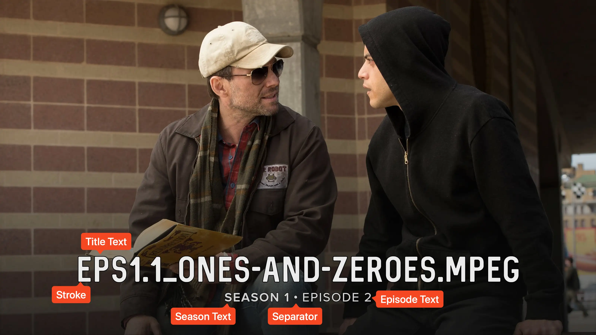
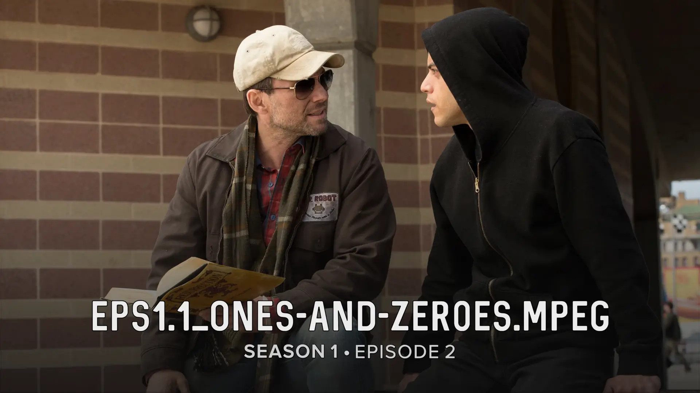
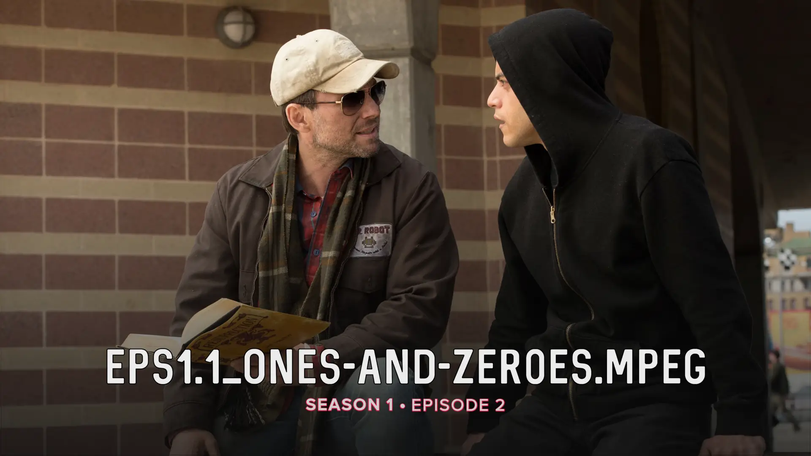
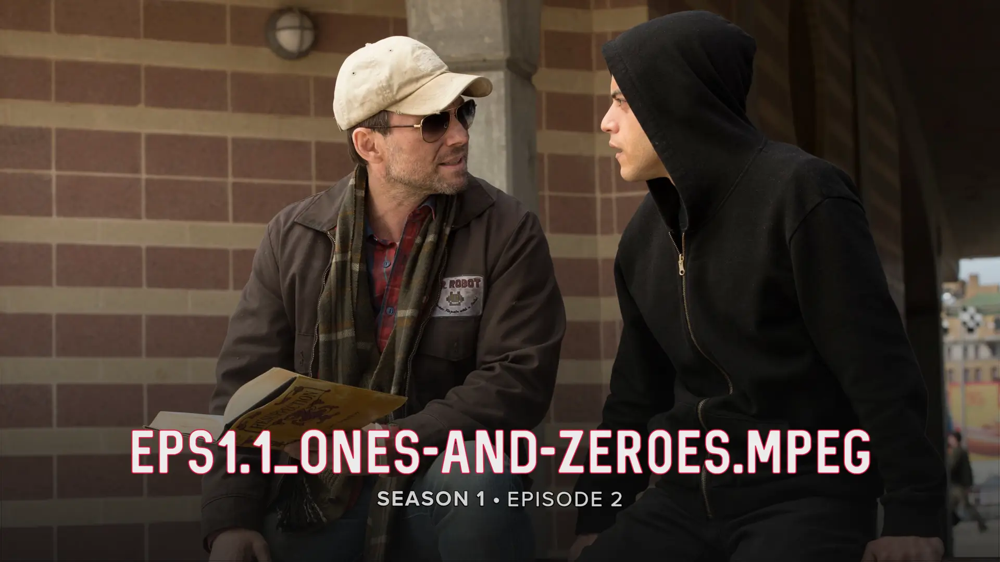
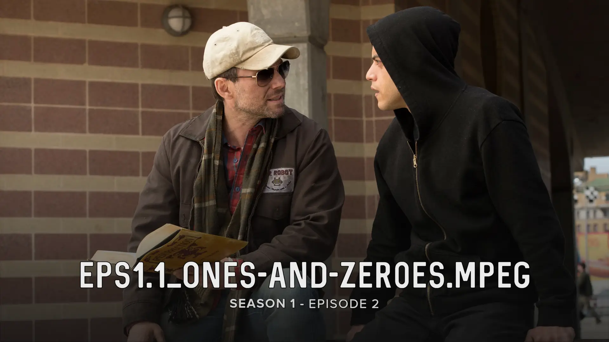
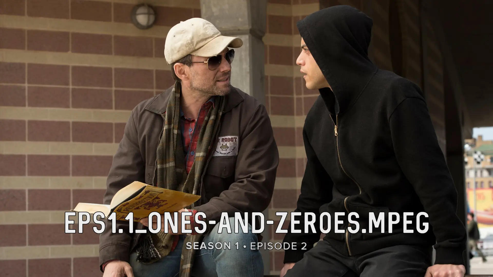

<link rel="stylesheet" type="text/css" href="https://unpkg.com/image-compare-viewer/dist/image-compare-viewer.min.css">

# Standard Card Type

This card design was created by Reddit user
[/u/UniversalPolymath](https://www.reddit.com/user/UniversalPolymath), with
additional development by [CollinHeist](https://github.com/CollinHeist).

This is the most "generic" title card type in TCM. It features center-aligned
season, episode, and title text positioned at the bottom of the image, with a
subtle gradient overlay applied by default to improve text legibility.

<figure markdown="span" style="max-width: 70%">
  
</figure>

??? note "Labeled Card Elements"

    

## Episode Text

Unless _explicitly_ stated otherwise, "episode text" here refers to both the
season and episode index text displayed above the title (e.g.
`SEASON 1 • EPISODE 1`).

### Color

The color of the index text can be adjusted with the _Episode Text Color_
extra. If unspecified, it defaults to `#CFCFCF`.

??? example "Examples"

    

        
        
    

### Size

The size of the index text can be adjusted with the _Episode Text Font Size_
extra. Values above `#!yaml 1.0` increase the size of the text, and values below
`#!yaml 1.0` decrease it.

??? example "Examples"

    

        
        
    

### Stroke Color

The color of the stroke applied to the index text can be adjusted with the
_Episode Text Stroke Color_ extra. If unspecified, it defaults to `black`.

??? example "Examples"

    

        
        
    

### Vertical Shift

The vertical position of the index text can be adjusted with the _Episode Text
Vertical Shift_ extra. Positive values shift the index text down, and negative
values shift it up.

??? example "Examples"

    

        
        
    

## Stroke Text Color

The color of the stroke applied to the title text can be adjusted with the
_Stroke Text Color_ extra. If unspecified, it defaults to `black`.

??? example "Examples"

    

        
        
    

## Separator Character

When both season and episode text are shown, a separator is placed between them.
The _Separator Character_ extra controls this character. The default is `•`.

??? example "Examples"

    

        
        
    

## Gradient Overlay

A gradient is applied over the source image by default to improve legibility. It
can be removed by setting the _Gradient Omission_ extra to `True`.

!!! warning "Text legibility"

    With the gradient omitted, text may be harder to read on bright images.

??? example "Examples"

    

        
        
    

## Mask Images

This card also natively supports [mask images](../user_guide/mask_images.md).
Like all mask images, TCM will automatically search for alongside the input
Source Image in the Series' source directory, and apply this atop all other Card
effects.

!!! example "Example"

    

        
        
    

