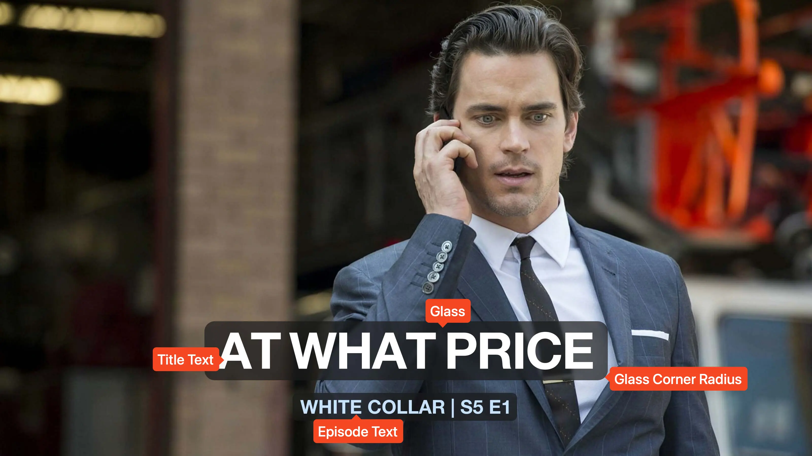

<link rel="stylesheet" type="text/css" href="https://unpkg.com/image-compare-viewer/dist/image-compare-viewer.min.css">
<script src="../../javascripts/imageCompare.js" defer></script>

# Tinted Glass Card Type

This card design was created by [CollinHeist](https://github.com/CollinHeist),
and was inspired by Reddit user's
[/u/RaceDebriefF1](https://www.reddit.com/user/RaceDebriefF1) Title Cards for
Lucky! (2022). These cards have a darkened and blurred rounded rectangle in the
area behind the title and episode text.

<figure markdown="span" style="max-width: 70%">
  
</figure>

??? note "Labeled Card Elements"

    

## Episode Text

Unlike most cards, this card type does not feature any season text. The season
number/text shown in the default card layout is actually a part of the episode
text, which is formatted as:

```python
{series_name} | S{season_number} E{episode_number}
```

Because of this, custom season titles will not work __by default__. These can
be used if `S{season_number}` is changed to `{season_title}` or `{season_text}`.

### Color

The color of the episode text can be adjusted with the _Episode Text Color_
extra.

??? example "Example"

    <div class="image-compare example-card"
        data-starting-point="50"
        data-left-label="#53B6E2"
        data-right-label="rgb(198, 226, 255)">
        
        
    </div>

### Position

The position of the epiode text relative to the title text can be adjusted with
the _Episode Text Position_ extra. This will reposition the episode text and
glass, __not__ the title text/glass.

??? example "Example"

    <div class="image-compare example-card"
        data-starting-point="50"
        data-left-label="right"
        data-right-label="center">
        
        
    </div>

### Vertical Adjustment

The vertical positioning of the episode text and glass can be adjusted with the
_Vertical Adjustment_ extra. This is documented [below](#vertical-adjustment-1).

## Glass

### Bound Adjustments

The dimensions of the glass box can be adjusted to appear further/closer to the
title text can be adjusted with the _Glass Adjustments_ extra. This is
particularly useful when using custom Fonts, as the builtin margin may not work
as desired. This adjustment only affects the boundaries of the title text glass.

This works like all other Box/Glass Adjustment extras, as a space-separated set
of four numbers which represent how to adjust the boundaries of each face (in
clockwise order).

??? example "Example"

    <div class="image-compare example-card"
        data-starting-point="50"
        data-left-label="-10 -10 -10 -10"
        data-right-label="0 0 0 0">
        
        
    </div>

### Color

The color of both glass boxes can be adjusted with the _Glass Color_ extra. In
order to maintain the "glass" effect, it is recommended to provide a color with
transparency - such as `rgba()` or `#rrggbbaa`.

??? example "Example"

    <div class="image-compare example-card"
        data-starting-point="50"
        data-left-label="rgba(166, 166, 166, 0.5)"
        data-right-label="rgba(25, 25, 25, 0.7)">
        
        
    </div>

### Corner Radius

The roundness of the glass rectangles can be adjusted with the _Glass Corner
Radius_ extra. The higher the radius/value, the rounder the edges. A value of 1
will result in nearly square corners.

??? example "Example"

    <div class="image-compare example-card"
        data-starting-point="50"
        data-left-label="1"
        data-right-label="40">
        
        
    </div>

### Vertical Adjustment

The vertical positioning of both the title and episode text/glass can be
adjusted with the _Vertical Adjustment_ extra.  

??? example "Example"

    <div class="image-compare example-card"
        data-starting-point="54.45"
        data-left-label="-50"
        data-right-label="0">
        
        
    </div>

## Mask Images

This card also natively supports [mask images](../user_guide/mask_images.md).
Like all mask images, TCM will automatically search for alongside the input
Source Image in the Series' source directory, and apply this atop all other Card
effects.

!!! example "Example"

    <div class="image-compare example-card"
        data-starting-point="10.9"
        data-left-label="Mask Image"
        data-right-label="Resulting Title Card">
        
        
    </div>
